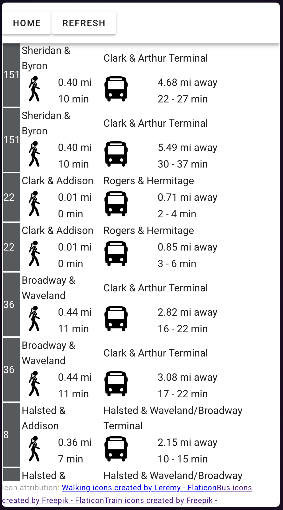

# Chicago Transit Arrival Estimates

This is an in-progress project to provide estimates of transit vehicle arrivals in Chicago. This 
project includes features not commonly seen in other trackers:

- Consideration of walking time to stops when showing nearby vehicles. The app uses an on-street 
  routing engine (Valhalla) to calculate pedestrian walking time from the input location to the 
  transit stop, both displaying this estimated time and filtering out vehicles that will have 
  arrived at the stop sooner than the estimated walking time.
- Display of vehicle arrival estimates as a time range rather than a single number. The backend 
  keeps a history of recent vehicle arrivals and uses the distribution of recent journey times 
  from a given position on the route to the desired stop to calculate this estimate range. This 
  can lead to a better user experience, especially when taking buses which tend to have a more 
  variable arrival time.

Initial feature work is largely complete. Current efforts are focused on making the backend 
stable and performant enough for generally reliable use, as well as adding observability and 
testing.

## Screenshots

### Route selection overview

### Arrival prediction detail

# Architecture Notes

## Scraper

The CTA (Chicago Transit Authority) operates bus and urban heavy rail service in Chicago and 
immediately surrounding communities. It provides real-time vehicle position information and 
departure and arrival estimates through two separate APIs, the Bus Tracker API and the 
Train Tracker API. The scraper queries these APIs at rates designed to gather complete, up-to-date 
information from the entire system while staying well under individual user rate limits.

Non-error responses from the tracker APIs are stored in memory for up to 5 minutes and then 
written as a JSON file to s3. There is also an instance of Redis with pub/sub channels running 
alongside the scraper. Each API update is sent to this instance for publishing; the History 
State Manager (below) subscribes to these updates.

### Bus Scraper 

Chicago has over 100 bus routes, some rush hour only and some 24/7. The API to get vehicle positions 
only accepts 10 routes at a time so the scraper keeps track of when each route was last queried as 
well as whether it was in operation at the time, tuning its scraping to ensure even coverage of 
routes that are currently operating while polling other routes at ~30 minute intervals to see if 
they've started running again. This allows the scraper to operate fairly efficiently without 
introducing a dependency on schedules.    

In addition to vehicle positions, the scraper also scrapes departure time estimates at the first 
stop of each route pattern.

### Train Scraper

The train tracker API will return the position of all train vehicles in the system in a single
request, so the scraper simply issues this request at 1-minute intervals. As with buses some 
train lines run 24/7 so the scraper also operates around the clock. The scraper also queries 
terminal stations for departure time estimates.

## History state manager

This consists of a PostgreSQL database with PostGIS extensions. The database stores the most 
recent position of every bus and train, recent departure predictions, and a 24-hour history of 
observed bus and train positions. It also stores transit stop locations and vehicle patterns. 
The database is used to query stops near a specific transit location, vehicles in locations that 
will be approaching a given stop in the future, and the location history of vehicles that arrive 
at a given stop. This information is used to provide more accurate predictions on when a vehicle 
will arrive at a certain stop given its current position.

The database is populated by subscribing to the scraper's Redis pub/sub instance.

## Query backend

This Python server using the FastAPI library implements backend endpoints that find nearby stops,
current transit vehicles, and vehicle location history by querying the history state manager 
database.

## Query frontend

This frontend, written in Vue, handles the interface that allows searching for and displaying 
nearby transit vehicles with arrival estimates. It calls the query backend to get its results.
